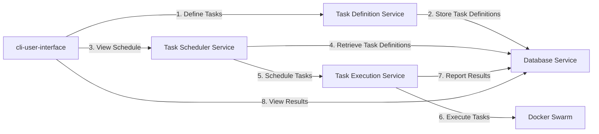

# Go Distributed Task Scheduler



## Quick Start
```bash
# get the project
git clone https://github.com/lantos1618/go_distributed_task_scheduler

# build the project
docker-compose up
```


## Overview
This project involves the creation of a distributed task scheduler using 
- Go
- gorpc
- Docker Swarm
- PostgreSQL
- Protocol Buffers

The task scheduler will be capable of scheduling tasks across multiple nodes in a Docker Swarm. Tasks will be defined using Protocol Buffers.

## Components
### Task Definition Service
requires:
- go
- gorpc

This service allows users to define tasks. 
Where each task will have;
- a unique ID
- a name
- a description
- a schedule (which could be a simple timestamp or a more complex cron-like schedule).

### Task Scheduler Service
requires:
- go
- gorpc
- Docker Swarm 

This service is responsible for scheduling tasks. It will communicate with the Task Definition Service to retrieve the list of tasks and schedule these tasks to run on the nodes in the Docker Swarm.

### Task Execution Service

requires:
- go
- gorpc
- Docker Swarm 

This service will run on each node in the Docker Swarm. It will be responsible for executing the tasks that have been scheduled on that node. 

Once a task is executed, the service will report the result back to the Task Scheduler Service.

### Database Service
requires:
- go
- gorpc
- PostgreSQL


This service will store; 
- task definitions, 
- the schedule for each task
- the result of each task execution. 
The Task Definition Service, Task Scheduler Service, and Task Execution Service will all communicate with the Database Service to store and retrieve this information.

### CLI User Interface
This module is a command-line user interface that will allow users to interact with the system. The user interface, which will be built with Go and gorpc, will allow users to define tasks, view the schedule, and view the results of task executions. It will communicate with the other services using gorpc.

### Steps
1. Define the Protocol Buffers for the tasks.
2. Implement the Task Definition Service.
3. Implement the Database Service.
4. Implement the Task Scheduler Service.
5. Implement the Task Execution Service.
6. Implement the User Interface.

Test the system by defining some tasks, scheduling them, and then checking that they are executed correctly.